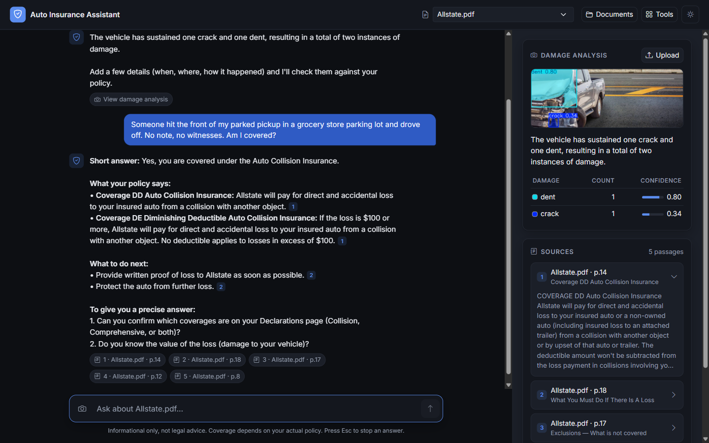
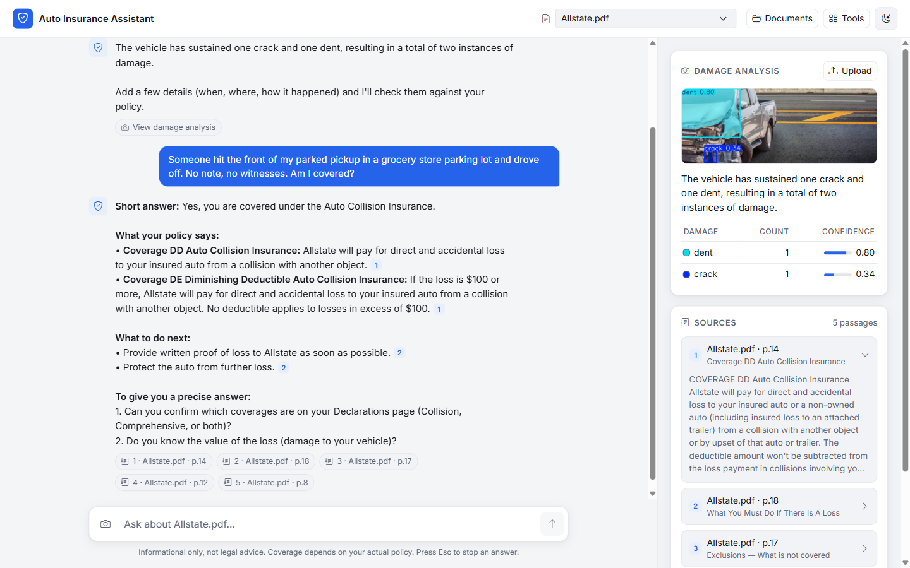
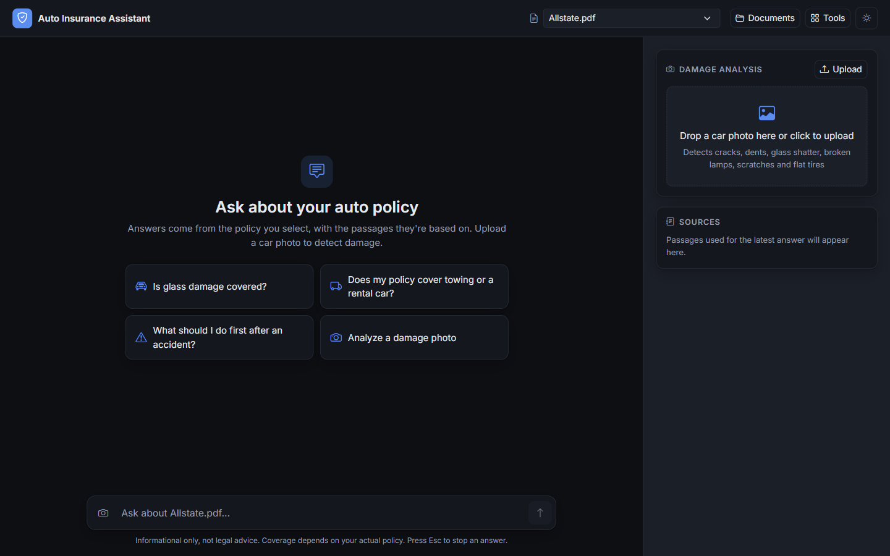
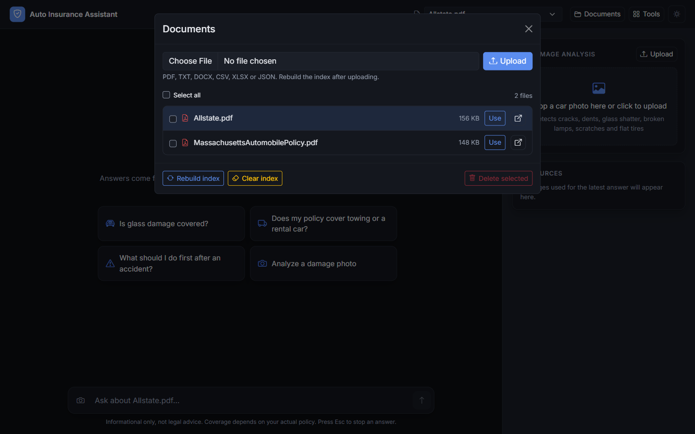
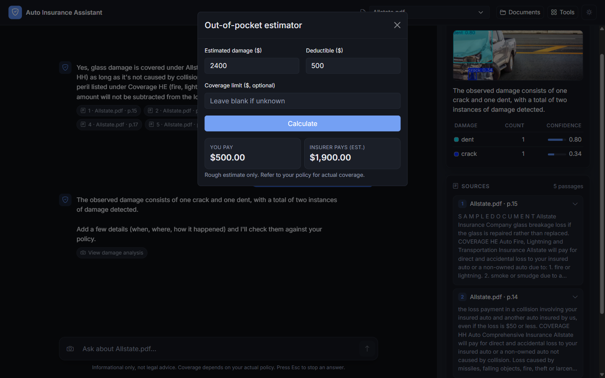

# Auto Insurance Assistant

A local, privacy-friendly assistant for car-insurance claims. Describe what happened (and add a photo of the damage); it works out which coverage in **your own policy** applies, explains the conditions with **cited passages**, lists the steps the policy requires, and asks the follow-up questions that would change the answer.

Everything runs on your machine: embeddings, vector search, the LLM (Qwen 2.5 7B via Ollama) and the vision model. No document or photo leaves the device.



## Features

- **Coverage-aware answers** – before searching, the assistant reads a catalogue of the policy's coverages (built automatically from its Parts and Coverage headings) and picks the ones whose definition fits the loss. "Someone hit my parked truck and drove off" goes to *Collision*, not to the *Uninsured Motorists* hit-and-run clause that merely sounds similar, and the coverage's *Exclusions* are pulled in automatically.
- **Cited sources** – every statement cites a numbered passage; each citation shows file, page range and policy section (e.g. *Coverage UU Rental Reimbursement*), and clicking it opens the passage in the side panel.
- **Follow-up questions** – when the answer depends on facts it doesn't have (which coverages you bought, whether anyone was hurt, whether the police were notified), it ends with 1–3 targeted questions, and it doesn't re-ask what you already said.
- **Conversation memory** – follow-ups such as "can I get a rental?" keep the context of the earlier turns.
- **Damage detection** – upload or drop a car photo; a YOLOv11-seg model trained on the [CarDD](https://cardd-ustc.github.io/) dataset segments six damage types (crack, dent, glass shatter, lamp broken, scratch, tire flat). The side panel shows the annotated image and a count/confidence table, and the findings are kept as known facts for the rest of the conversation.
- **Document management** – upload PDF / TXT / DOCX / CSV / XLSX / JSON files, rebuild or clear the index, delete files.
- **Quick tools** – out-of-pocket estimator, FAQs, contact form. Claim status is a demo stub.
- **Light and dark themes**, phone-width layout.

<details>
<summary>More screenshots</summary>

| | |
|---|---|
|  |  |
| Light theme | Start screen with suggested questions |
|  |  |
| Document manager | Out-of-pocket estimator |

</details>

## How it works

```
Indexing   policy PDF → clean text (watermarks removed) → 800-char chunks that run across page breaks
                      → each chunk tagged with its section ("Part 6 … / Coverage DD Auto Collision Insurance")
                      → all-MiniLM-L6-v2 embeddings → FAISS
                      → coverage catalogue: every Part / Coverage / Exclusions / duties section + its opening words

Question   1. route     LLM reads the catalogue + the customer's situation → picks the coverage(s) that fit
                        (+ that Part's Exclusions)
           2. retrieve  routed sections, starting at their heading, + top vector-search hits from the same policy
                        (each hit extended with the next chunk of its section)
           3. answer    system prompt + last turns + photo facts + numbered passages → Qwen 2.5 7B (Ollama)
                        → streamed answer: short answer · what your policy says [n] · what to do next · questions
                        citations (file, page range, section) go to the UI in the X-Sources header

Photo      YOLOv11-seg (CarDD, 6 classes) → masks + counts → LLM summary → kept as facts for the conversation
```

| Layer | Tech |
|---|---|
| Web app | Django 5.1, Bootstrap 5 + Bootstrap Icons, vanilla JS (streaming via `fetch` + `ReadableStream`) |
| Retrieval | LangChain loaders, section-aware chunking, `sentence-transformers` (all-MiniLM-L6-v2), FAISS, LLM coverage routing |
| Generation | Qwen 2.5 7B through [Ollama](https://ollama.com) (any Ollama model works; a Hugging Face backend is also supported) |
| Vision | Ultralytics YOLOv11 segmentation, OpenCV |

### Project layout

```
insuranceasst/
├── backend/
│   ├── data_loader.py      # load PDF/TXT/CSV/XLSX/DOCX/JSON, strip page watermarks
│   ├── embedding.py        # section detection + cross-page chunking + embeddings
│   ├── vectorstore.py      # FAISS index: build, save/load, per-file query (optional BM25 hybrid)
│   └── search__.py         # RAGSearch: coverage catalogue + routing, retrieval, prompt, Ollama/HF backends
├── chat/
│   ├── views.py            # page + JSON/streaming API endpoints
│   ├── templates/chat/index.html
│   ├── static/chat/        # script.js, style.css
│   └── management/commands/
│       ├── build_index.py  # python manage.py build_index
│       └── evaluate.py     # python manage.py evaluate (see "Checking answer quality")
├── eval/scenarios.json     # test conversations with the correct coverage, pages and traps
├── insuranceasst/settings.py
├── data/                   # policy documents (served at /media/); claim photos in data/images/claims/
├── faiss_store/            # generated vector index
└── models/                 # YOLO weights (yolov11-seg-cardd.pt)
```

## Getting started

### Prerequisites

- Python 3.11
- [Ollama](https://ollama.com/download) with the Qwen 2.5 7B model (~4.7 GB):
  ```bash
  ollama pull qwen2.5:7b
  ```
- Recommended: an NVIDIA GPU with ~6 GB free VRAM for the LLM. For GPU vision inference, install the CUDA build of PyTorch; without it YOLO runs on CPU automatically.

### Install

```bash
git clone <this-repo>
cd InsurnceAsst
python -m venv .venv
# Windows: .venv\Scripts\activate    macOS/Linux: source .venv/bin/activate
pip install -r requirements.txt
```

### Add the assets that are not in git

PDFs, model weights and the index are git-ignored, so add them before the first run:

1. **Policy documents** – put one or more policy files in `insuranceasst/data/` (or upload them later from the UI).
2. **Vision model** – place the trained CarDD YOLOv11-seg weights at `insuranceasst/models/yolov11-seg-cardd.pt` (path set by `CARDD_MODEL_PATH` in settings).

### Run

```bash
cd insuranceasst
python manage.py migrate            # first run only
python manage.py build_index        # rebuild after changing documents (also built automatically on first use)
python manage.py runserver
```

Open <http://127.0.0.1:8000>, pick a policy in the top bar, then ask a question or upload a car photo in the **Damage analysis** panel.

The first question after startup takes up to a minute while the embedding model and the LLM load; after that, answers start streaming within a few seconds on a GPU.

## Configuration

Set in `insuranceasst/insuranceasst/settings.py`:

| Setting | Default | Purpose |
|---|---|---|
| `LLM_BACKEND` | `"ollama"` | `"ollama"` or `"hf"` (Hugging Face Transformers, loaded in 4-bit) |
| `LLM_MODEL` | `"qwen2.5:7b"` | Ollama model name (e.g. `mistral`, `llama3.1:8b`), or a Hugging Face repo id when `LLM_BACKEND="hf"` |
| `RAG_ROUTE` | `True` | LLM picks the relevant coverage sections from the policy's catalogue before searching |
| `RAG_NEIGHBORS` | `True` | Extend each retrieved chunk with the next chunk of the same section |
| `RAG_HYBRID` | `False` | Fuse BM25 keyword search with vector search (needs `rank_bm25`) |
| `RAG_EXPAND_QUERY` | `False` | LLM rewrites the customer's story into policy terms before searching |
| `FAISS_DIR` | `BASE_DIR / "faiss_store"` | Where the vector index is stored |
| `MEDIA_ROOT` | `BASE_DIR / "data"` | Document and claim-photo folder |
| `CARDD_MODEL_PATH` | `models/yolov11-seg-cardd.pt` | YOLO segmentation weights |

The `OLLAMA_HOST` environment variable points the app at a non-default Ollama server. Rebuild the index (`build_index` or **Documents → Rebuild index**) after changing documents or upgrading, so chunks carry section and page-range data.

## API

| Method | Endpoint | Body | Returns |
|---|---|---|---|
| `POST` | `/api/chat/stream/` | `{"message", "doc"?, "history"?, "facts"?}` | Streamed plain-text answer; citations in the `X-Sources` header |
| `GET`/`POST` | `/api/chat/` | `?q=&doc=` or `{"message", "doc"?, "history"?}` | `{"answer"}` |
| `POST` | `/api/vision/analyze/` | multipart `image` | `{"annotated_url", "counts", "detections", "summary"}` |
| `GET` | `/api/files/` | – | Files in `data/` |
| `POST` | `/api/files/upload/` | multipart `file` | `{"saved_as", "url"}` |
| `POST` | `/api/files/delete/` | `{"names": [...]}` | `{"deleted", "missing"}` |
| `POST` | `/api/reindex/` | – | Rebuilds the FAISS index from `data/` |
| `POST` | `/api/vectors/clear/` | – | Deletes the FAISS index |
| `GET` | `/health/` | – | `{"ok": true}` |

- `doc` is a file name such as `Allstate.pdf`; retrieval is limited to that file.
- `history` is the last few turns as `[{"role": "user"|"assistant", "content": "..."}]` (the server keeps the last 6).
- `facts` is free text the assistant should treat as known, e.g. the photo-analysis findings.
- `X-Sources` is a JSON array of `{"name", "page", "page_end", "section", "snippet"}` (1-based pages; `null` for non-PDF files). It is a header so the answer can start streaming immediately.

## Checking answer quality

`eval/scenarios.json` holds realistic claim conversations for both sample policies (hit-and-run, deer strike, cracked windshield, theft, rental, breakdown and tow, injury by an uninsured driver, an out-of-scope premium question, and Massachusetts-specific rules). Each turn records the correct answer, the pages it comes from, phrases the answer must contain, statements it must not make (traps such as "Uninsured Motorists pays for the car"), and what good follow-up questions look like.

```bash
cd insuranceasst
python manage.py evaluate                              # current settings and model
python manage.py evaluate --model mistral --route off  # compare a model / switch features
python manage.py evaluate --regrade <run-folder>       # re-score saved answers after editing the scenarios
```

Each run writes `results.md` (per-turn answers, sources and problems) and `results.json` to `eval-runs/<date>_<label>/`, which is git-ignored. Use it to compare models and retrieval settings on your own hardware before changing defaults.

## Limitations

- **Not legal or insurance advice.** Answers come from a 7B local model. It can pick the wrong coverage (for example Collision instead of Comprehensive for a cracked windshield), miss an exception that is in a cited passage, overstate certainty ("you are covered" rather than "you are covered if you bought collision"), or answer questions the policy doesn't address. Check the cited passages before relying on an answer.
- **Follow-up questions are uneven** – often useful ("Which coverages are on your Declarations page?"), sometimes off-target.
- **Coverage routing relies on section headings.** It is built for policies organised in Parts and Coverages with a table of contents (as in the two sample policies); other documents fall back to plain vector search.
- **Development setup only.** `DEBUG=True`, a committed `SECRET_KEY`, no authentication, and CSRF-exempt write endpoints. Do not expose it to a network as is.
- The vision model detects damage *types*, not severity or repair cost, and only the six CarDD classes.
- Claim status is a placeholder response.
